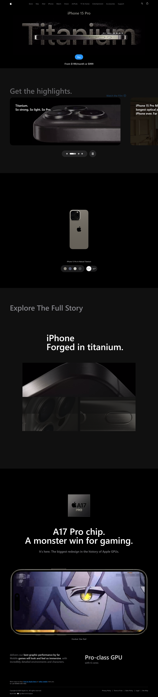

# iPhone 15 Pro Clone Website

## Description

This project is a clone of the iPhone 15 Pro website, showcasing an interactive 3D model built with React and Three.js.

## Features

- Interactive 3D model using Three.js
- Responsive design for various devices

## Technologies Used

- React
- Three.js
- GSAP

## Screenshots

## Installation Instructions

To run this project locally, follow these steps:

1. Clone the repository.
2. Navigate to the project directory.
3. Install dependencies using npm:
